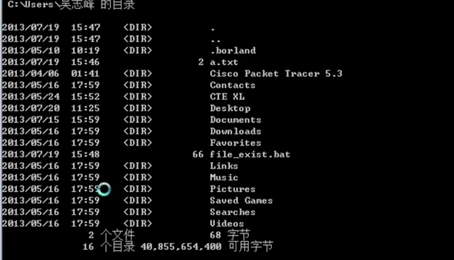

# Windows批处理命令

## 基本命令

### 1.copy con+文件名 创建文件

​    将窗口输入内容写入到文件中

​    结束Ctrl+Z

### 2.echo 回显命令

​	命令描述 echo [{on|off}] [message]

​    echo 内容 .>文件 将内容写到文件中

   @符 不回显命令 只针对当前行，不管echo

   echo on/off 开启和关闭回显，当前行之后的命令生效

### 3.type与find 显示文件内容

 type 文件名 显示文件内容

find  [/v /c /n /i]   string  文件路径

/v  未包含字符串的行

/c 文件行数

在文件中找匹配字符

```
@echo off
echo 111 > test.txt
echo 222 >> test.txt

find "111" test.txt  #显示文件名和字符 ------TEST.TXT
type test.txt | find "111" #不会返回文件名，没找到就没结果
```


### 4.pause 等待用户确认 终端显示输入任意键

 echo 不显示输入... & pause >nul

### 5.call 调用

call [dirve:] [path] filename [batch-params]

call :label args


  call [FilePath [BatchParams]] 同目录可以省略路径直接文件名

   1）call+脚本文件 调用脚本文件执行。

call [FilePath [BatchParams]] [[:lable]] [args]

   2）call :XX(标记) 执行标号后的命令，会返回调用处继续执行

​    :XX 

​     ****(命令)

### 6.rem和:: 注释命令

  rem的行不会执行，但echo on的时候会回显，建议使用

  :: 注意与:lable区别，::也可以当注释，不回显

### 7.set 用于创建变量

   set [[/a [expression]] [/p [variable=]]  string ]

​     /a表达式求值         /p获取用户输入（当做字符串）

​	`set XXX=“C:\”   XXX变量赋值`

​    `set /p pop=请输入参数`

​    `set X   显示所有以X开头的变量`

​	`dir /w %XXX%    dir /w 以列表形式显示； %XXX%使用变量`

​	`set XXX=   删除XXX变量`

### 8.goto 流程跳转命令

​	goto 跳过中间命令，执行最后一个命令

   语法 goto label

   `@echo off`

​	`goto last`

​    `dir`

​    `:last`

​    `dir a.txt`

### 9.start 打开新的窗口

​	start  “txt内容” /wait  type a.txt

​    start  [窗口名] [/d 路径] [/i:] [/min] [/max] [{/separated|/shared}] [/wait等待新窗口结束]

​    start explorer d:/  # 调用资源管理器

### 10.if 条件判断命令

​	if else 

​	if not 

​	if [/i] str1 str2 compareop     字符串比较，/i忽略大小写，

​								compareop： EQU等于 NEQ不等于 LSS小于 LEQ小于等于 GTR大于 GEQ大于等于

​	`@echo off`

​    `if exist a.txt ( echo 找到a.txt 内容：type a.txt) else (echo 没找到文件)`

​    if defined variable (echo 定义了variable) else...

### 11.for  循环

for /f  解析文本或字符串,配合delims 

```
把文件改为日期时间

@echo off
if not exist %1 ( 
echo 请输入需要修改的文件名
echo.
goto end
)
set extension=%~x1  ### %~x1 取%1的扩展名，~x是取扩展名

for /F "tokens=1-3 delims=/- " %%A in ('date/t') do set date=%%A%%B%%C
####date/t 取时间（2013-07-23 周四） tokens：循环个数 delims：分隔符

ren "%1" "%date%%extension%"
echo.
echo 文件%1 更名为%date%%extension%
set extension=
set date=

:end
```

```
计算目录占用磁盘空间

@echo off
for /f "tokens=*" %%a in ('dir') do (
 echo "%%a" | find "个文件" >nul && for /f "tokens=3*" %%b in ("%%a") do(
 ####  &&是前面一个命令成立的情况下执行后面的命令  tokens=3*是取第三列
 echo 当前目录大小： %%b%%c
 )
)
echo 子目录所占空间大小如下：
for /f %%a in ('dir /ad/s/b') do(
for /f "tokens=*" %%b in ('"dir %%a\"') do(
echo "%%b" | find "个文件" >nul && for /f "tokens=3*" %%c in ("%%b") do(
echo %%a:%%c%%d
)
)
)

```



for /d 目录 

​	for /d %%i in  (*)  do  #只遍历目录

for /r 递归遍历目录

for /l   数字范围循环

​	for /l %%n in (0,1,99)  #在数字0-99范围循环，步长1

	set /a sum=0
	
	for %%x in (*.txt) do(
	
	echo %%x文件内容：
	
	type %%x
	
	echo .
	
	set /a sum=sum+1
	
	)

​    echo 一共显示%sum%个文本```

%%x 表示 *.txt 批处理中执行的，变量区分大小写

### 12.setlocal 设置临时环境变量

​       setlocal endlocal 两个配合管理临时环境变量生命周期

### 13.shift 更改批处理文件的起始

   shift [/n] n范围0-8   

​	执行 shift.bat a.txt b.txt,shift改变%1的值

	 :round
	 if "%1"=="" goto end #判断命令行输入参数，范围0-9
	 echo %1内容如下
	 type %1
	 echo .
	 shift
	 goto round
	 :end

### 14.*与？ 通配符

  *多个字符，？一个字符

### 15.重定向符 > <  >> ，管道符 |

	> <是替换
	
	>> 是添加
	
	@echo off
	echo type a.txt > auto.bat
	echo  dir /b /w >> auto.bat
	echo 排序后的auto.bat为
	sort < auto.bat   #sort关键字，用于排序
	

| 将一个命令的结果传给另一个命令

```
@echo off
find "redirection" gpl.txt | sort > result.txt
echo 对包含“redirection” 的单词行排序后
type result.txt
```

### 16.其它win常用命令

```ren 文件重名```

nul 空设备  

%errorlevel% 环境变量，命令的一些状态 0 ok 

```
:again
ping www.baidu.com >nul
if not %errorlevel% EQU 0 goto again
start "正常" echo 正常通信
```

%~dp0 批处理文件的完整路径

%0批处理文件

```
@echo off
echo 当前文件%0
echo 完整路径%~dp0
echo.
```

%0 %1 --命令后的字符

date /t 显示当前日期，没有/t 等待用户输入日期

time /T 同上，显示时间

&& 前面的命令成功后执行后面的命令

|| 前面的命令失败后执行后面的命令

```
dir 目录遍历 详细百度
详细百度
DIR [drive:][path][filename] [/A[[:]attributes]] [/B] [/C] [/D] [/L] [/N]
  [/O[[:]sortorder]] [/P] [/Q] [/R] [/S] [/T[[:]timefield]] [/W] [/X] [/4]
  
/A          显示具有指定属性的文件。
  属性      D  目录               R  只读文件
           H  隐藏文件            A  准备存档的文件
           S  系统文件            I  无内容索引文件
           L  解析点             -  表示“否”的前缀

/B          使用空格式(没有标题信息或摘要)。（对于文件来说，只显示文件名和扩展名，这一条比较实用！）
```

  

### 17.title 与color

title设置命令行窗口名称

color设置窗口色彩 color F2  两个16进制数 代表前景和后景色


### 18.mode设置设备（串口，命令行窗口）

mode con cols=113 lines=15 & color 9f 设置窗口

### 19.assoc和ftype

assoc  设置文件扩展名关联

   assoc .txt 查看扩展名关联

   assoc.txt=Word.Document.8 设置扩展文件关联程序

ftype 文件类型关联

   ftype exefile

### 20.pushd和popd  切换目录

pushd 保存当前目录,并进入新路径

popd 返回到保存目录

```
@echo off
c: & cd\ & md mp3
md d:\mp4
cd /d d:\mp4
pushd c:\mp3
popd
```


### 21.关于参数

%0     %1

%*

%n

%1

%~f1

%~d1


```
@echo off
echo 产生一个临时文件 > tmp.txt
Rem 下行先保存当前目录，再将c:\windows设置为当前目录
pushd c:\windows
call :sub tmp.txt
popd

:sub
echo 删除引号：%~1
echo 扩充到路径 %~f1
echo 扩充到一个驱动器:%~d1
echo 扩充到一个路径:%~p1
echo 扩充到一个文件的扩展名:%~x1
echo 扩充的路径只含有短名:%~s1
echo 扩充到文件属性:%~a1
echo 扩充到文件的日期/时间:%~t1
echo 读取文件的大小:%~z1
echo 读取文件驱动器号和路径:%~dp1
echo 读取文件名和扩展名:%~nx1

goto:eof


```


  

## 用例

### 1.开发应用

```
根据输入属性打包

@echo off 
echo 请输入配置参数：：Dev,alpha,prd,test
set /p env=>nul
echo 配置环境 %env%
cd %~dp0
call mvn clean package -Denv=%env% -Dmaven.test.skip=true
pasue

```


```
批量拉取git
@echo off
setlocal enabledelayedexpansion
for /f %%i in ('dir /b /ad') do(
  echo %%i
  cd %%i
  git pull
  cd ..
)
```

### 2.文件和文件夹处理

```
更文件名
创建文件
```

